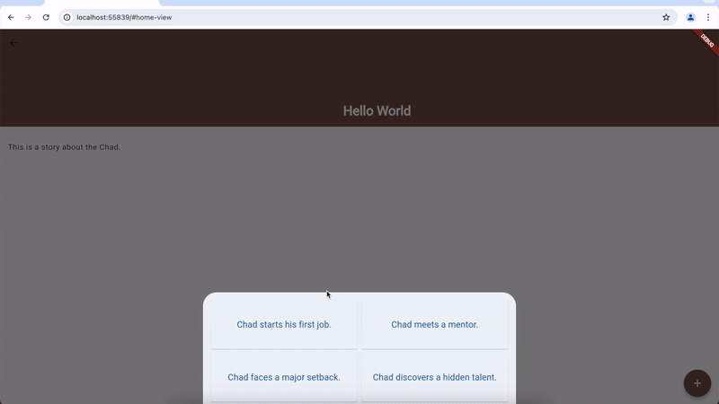

# Novel Maker

Novel Maker is a project developed to find an easier way to write novels. Users can utilize the app's features to generate four options for the next part of the story based on the previous content. Depending on the user's choice, the app will then generate the subsequent content.

## Demo Video

## Tech Stack

- Frontend: Flutter/Dart
- Backend: Python/FastAPI/LangChain/boto3
- Database: DynamoDB, S3
- CICD: Github Action
- Deployment: AWS ECS
- IaC: Terraform